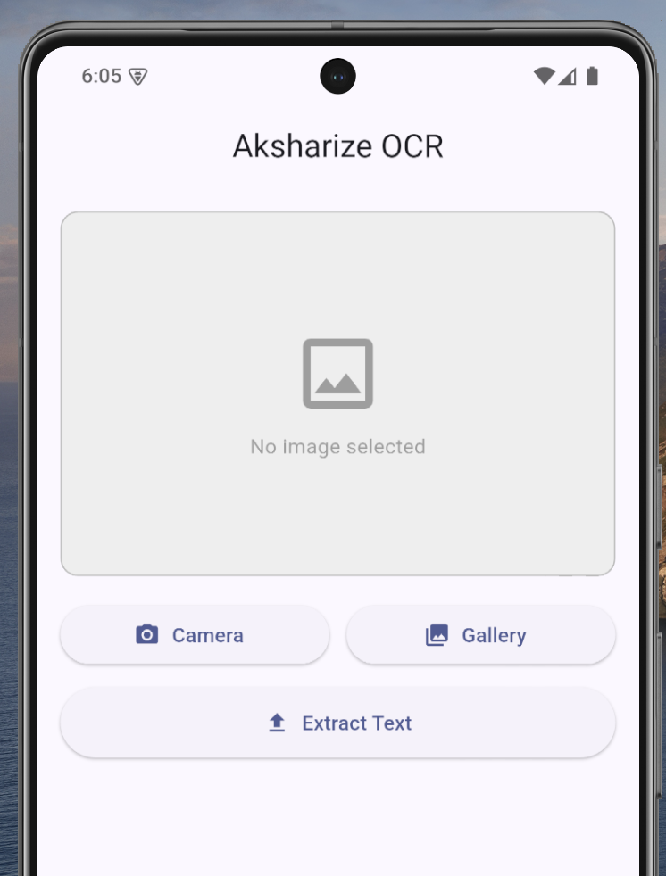
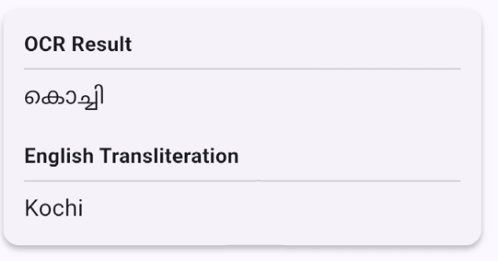

# Aksharize OCR MVP

Aksharize is a lightweight full-stack OCR application designed to recognize Malayalam text from signboards, street signs, and public displays, and provide readable English transliterations.

The project consists of:

1. **FastAPI Backend (Python)**  
   Decodes uploaded images, performs OpenCV preprocessing, runs Tesseract OCR, and transliterates Malayalam text into readable English.

2. **Flutter Frontend (Mobile)**  
   Allows users to capture images using the camera or select images from the gallery, preview them, upload them to the backend, and view OCR and transliteration results.

---

# Screenshots

## Home Screen



---

## Image Selected


---

## OCR Result



---

# Project Structure

```text
aksh/
├── backend/
│   ├── app/
│   │   ├── main.py
│   │   ├── routes/
│   │   │   └── ocr.py
│   │   └── services/
│   │       ├── ocr_service.py
│   │       └── transliteration_service.py
│   ├── requirements.txt
│   └── venv/
│
└── aksharize_app/
    ├── lib/
    │   ├── main.dart
    │   ├── home_screen.dart
    │   └── api_service.dart
    └── android/
```

---

# Features

- Malayalam OCR using Tesseract
- Malayalam to English transliteration
- Kerala place-name dictionary overrides
- Camera image capture
- Gallery image selection
- FastAPI backend
- Flutter mobile frontend
- JSON API responses
- OpenCV image preprocessing
- Cross-platform support

---

# Quick Start

## 1. Backend Setup (FastAPI)

### Prerequisites

#### Python

Install Python 3.10 or newer.

Verify installation:

```bash
python --version
```

or

```bash
python3 --version
```

---

### Install Tesseract OCR

#### macOS

Install Tesseract and language packs:

```bash
brew install tesseract
brew install tesseract-lang
```

Verify Malayalam support:

```bash
tesseract --list-langs
```

Expected output should include:

```text
eng
mal
```

---

#### Ubuntu / Debian Linux

```bash
sudo apt update

sudo apt install tesseract-ocr

sudo apt install tesseract-ocr-mal
```

Verify installation:

```bash
tesseract --version
```

Verify language availability:

```bash
tesseract --list-langs
```

Expected output:

```text
eng
mal
```

---

#### Windows

Download Tesseract from the UB Mannheim builds:

https://github.com/UB-Mannheim/tesseract/wiki

During installation:

- Select Malayalam language support.
- Install to the default location:

```text
C:\Program Files\Tesseract-OCR
```

Add Tesseract to your PATH:

```text
C:\Program Files\Tesseract-OCR
```

Verify installation from Command Prompt:

```cmd
tesseract --version
```

Verify Malayalam language support:

```cmd
tesseract --list-langs
```

Expected output:

```text
eng
mal
```

---

### Backend Installation

Navigate to the backend folder:

```bash
cd backend
```

### Create Virtual Environment

#### macOS / Linux

```bash
python3 -m venv venv
```

Activate:

```bash
source venv/bin/activate
```

---

#### Windows

Create environment:

```cmd
python -m venv venv
```

Activate (Command Prompt):

```cmd
venv\Scripts\activate.bat
```

Activate (PowerShell):

```powershell
.\venv\Scripts\Activate.ps1
```

---

### Install Dependencies

```bash
pip install -r requirements.txt
```

---

### Run Backend

```bash
uvicorn app.main:app --reload --port 8000
```

Backend URL:

```text
http://127.0.0.1:8000
```

Swagger Documentation:

```text
http://127.0.0.1:8000/docs
```

---

## 2. Frontend Setup (Flutter)

### Prerequisites

Install Flutter SDK:

https://flutter.dev/docs/get-started/install

Verify installation:

```bash
flutter doctor
```

Ensure all required dependencies are installed.

---

### Install Dependencies

Navigate to the Flutter application:

```bash
cd aksharize_app
```

Fetch packages:

```bash
flutter pub get
```

---

### Run Application

Start an emulator or connect a physical device.

Run:

```bash
flutter run
```

---

### Backend URL Configuration

For Android Emulator:

```text
http://10.0.2.2:8000
```

This is already configured in the application.

For a physical device, update the API base URL in:

```text
lib/api_service.dart
```

Example:

```dart
const baseUrl = "http://192.168.1.100:8000";
```

Replace with the local IP address of the machine running the FastAPI server.

---

# OCR & Transliteration Pipeline

## OCR Preprocessing

The OCR pipeline:

1. Receive uploaded image.
2. Decode image using OpenCV.
3. Convert image to grayscale.
4. Process using Tesseract OCR.
5. Extract Malayalam text.

Current Tesseract configuration:

```text
Language: mal
PSM: 8
OEM: 3
```

Optimized for:

- Street signs
- Place names
- Shop boards
- Public signage

---

## Transliteration Engine

The transliteration system uses two stages:

### Stage 1 — Dictionary Overrides

Known Kerala place names are mapped to their commonly accepted English spellings.

Examples:

| Malayalam | English |
|------------|----------|
| തൃശൂർ | Thrissur |
| കൊച്ചി | Kochi |

This ensures outputs match real-world signage and common usage.

---

### Stage 2 — Fallback Transliteration

If no dictionary match exists, the application falls back to the `indic_transliteration` library to generate a phonetic English transliteration of the OCR result.

---

# Future Improvements

- Support for additional languages
- OCR correction and post-processing improvements

---

# License

MIT License